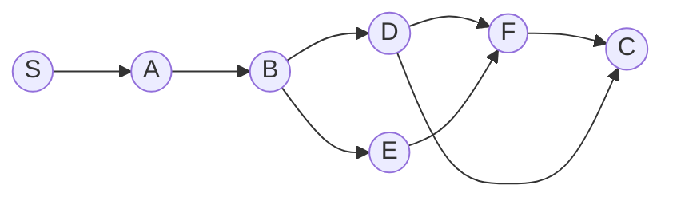
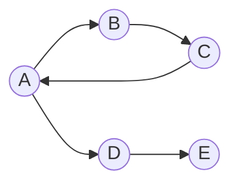

# Technical Assignment © Sarvam

## Finding the Invariants in a Workflow Graph

### Characteristics of a Workflow Graph

1. **Will have a start and end node**
2. **Multiple outgoing edges per node**
3. **Multiple incoming edges per node**
4. **Directed graph etc**
5. **Each node can propagate the flow to a subset of its out edges**

### Observations

1. **Multiple paths can have been traversed to the end, or generically speaking, to any node**

2. **Two ways:**
   - Manage a frontier set of the edges being run or scheduled
   - Send something to all flows. For now, let's think this should be a sort of no-op signal that propagates. Hmm.

3. **Let's define reachable set R(x) as the set of nodes which can be reached from x**

   **RR(x) be "reverse reachable", set of nodes reachable from x in the reverse graph (all edge invert)**

Now, any node will have to be waiting till the frontier set has nothing (except itself) in its RR set.

Example: in above f cannot start executing till we have completed c and d. Their data is required.

### Some Invariants

1. **We cannot have isolated cycles**
2. **We cannot have isolated components**
3. **1 and 2 can be combined, isolated means either:**
   - They are not in R(s)
   - They are not in RR(e)

These constraints look succinct enough for now. These will ensure we never start with a bad graph.

There are some runtime considerations as well:

1. **It should be detectable if the frontier is not progressing:**
   - Taking too long in a node
   - Stuck in some cycle

Can there be deadlock scenarios? I'm not sure.

Another invariant/static check would be that we not have duplicate edges. An edge does not hold info as of yet, so we shouldn't have two.

**→ Invariant implies something that does not change over time, even when other things change. Calling the points here "characteristics" instead would be more appropriate.**
